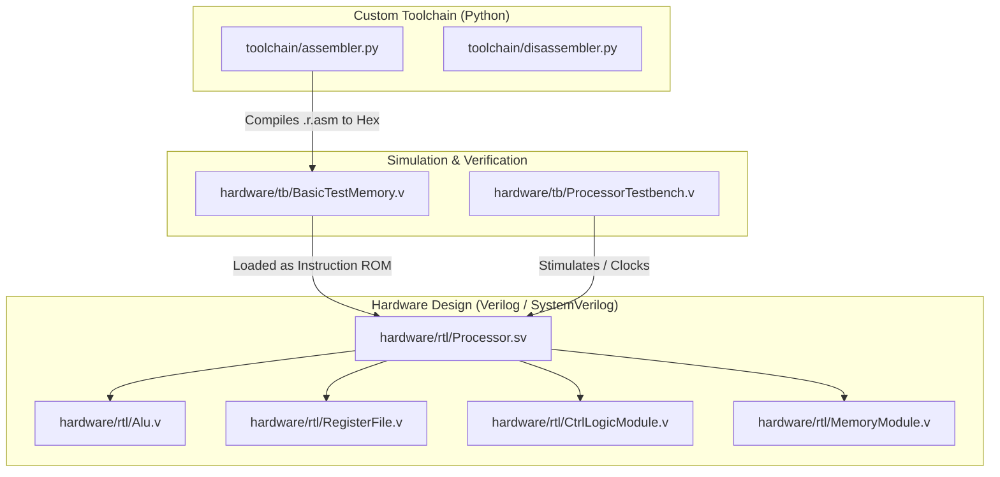

# 32-Bit Single-Core RISC Processor Core & Custom Toolchain

[](hardware/rtl/)
[](toolchain/)
[](Makefile)
[](LICENSE)

A custom-designed, **32-bit single-core unpipelined RISC processor core** implemented from scratch in Verilog HDL and SystemVerilog. This project represents a complete hardware-software co-design ecosystem, featuring high-fidelity processor RTL, comprehensive testbenches, and a custom-built compiler toolchain containing a modern Python 3 assembler and disassembler.

---

##  Restructured Directory Layout

The repository has been reorganized into a highly professional, modern directory layout separating hardware sources, software toolchains, documentation, and verification suites:

```text
Mini-RISC-Processor-with-Assembler/
├── hardware/               # All hardware design & verification sources
│   ├── rtl/                # Production RTL implementation (Verilog/SystemVerilog)
│   │   ├── Alu.v           # Arithmetic Logic Unit
│   │   ├── Processor.sv    # Core CPU Top-level routing
│   │   ├── RegisterFile.v  # General Purpose Registers (GPRs)
│   │   ├── CtrlLogicModule.v# Core Control Unit decoder
│   │   └── ...             # Peripherals, Display logic, VGA sync
│   └── tb/                 # Stimulus & simulation testbenches
│       ├── ProcessorTestbench.v # Core system verification bench
│       ├── BasicTestMemory.v    # Synthesized ROM model for tests
│       └── ...             # Unit testbenches for individual modules
├── toolchain/              # Custom software ecosystem (Python 3)
│   ├── assembler.py        # Compiles assembly source (.r.asm) to binaries/hex
│   └── disassembler.py     # Translates 32-bit hex bytes back into assembly text
├── tests/                  # Validation programs & documentation
│   ├── assembly/           # Assembly test programs (e.g., BasicTest.r.asm)
│   └── descriptions/       # Hardware error and branch execution maps
├── examples/               # Complete demonstration applications
│   ├── powers-of-two/      # Generates powers of two inside simulation
│   └── simple-display/     # Custom graphics/display application examples
├── docs/                   # Specifications, schematic PDFs & diagrams
│   ├── diagrams/           # XML & PNG images of processor routing
│   └── spec/               # ALU OP codes, register mappings, and hardware schematics
├── Makefile                # Unified build, compile & simulation driver
├── .gitignore              # Standard ignore filters (Python, IDE, HDL waves)
└── README.md               # Premium project documentation
```

---

##  Architecture & Specifications Overview

Inspired by the structured computational principles of the **MIT 6.004 (Computation Structures) Beta architecture**, this processor implements a robust, instruction-set architecture optimized for learning and modular hardware designs.

### Memory & Data Path
* **Data Path:** 32-bit registers, 32-bit internal busses, and a 32-bit ALU.
* **Addressing Model:** Byte-addressable physical memory. Access operations are word-aligned, fetching 4 bytes ($32\text{ bits}$) in parallel.
* **Maximum Address Space:** Full $2^{32}$ byte ($4\text{ GB}$) memory capabilities.

### General Purpose Registers (GPR)
* **Configuration:** $32$ registers (`r0` to `r31`), each 32 bits wide.
* **Constant Zero:** Register `r31` is hardwired to `0x00000000` at the physical hardware level, serving as a permanent zero constant.
* **System Registers:** Registers `r27` (XP), `r28` (LP), `r29` (SP), and `r30` (BP) are reserved for exceptional handling, stack frames, and linkage.

---

##  Privilege Levels & Exception Traps

The processor supports two hardware-enforced privilege rings, providing isolation between the kernel and userland applications:

| Privilege Ring | PC MSB | Description | Action on Hardware Interrupt / Exception |
| :--- | :--- | :--- | :--- |
| **User Mode** | `0` | Restricted execution ring. If an illegal opcode or interrupt occurs, the hardware automatically switches rings. | Swaps to **Supervisor Mode**, saves returning address to `XP` (`r27`), and branches to exception vector (`0x80000008`). |
| **Supervisor Mode** | `1` | Privileged execution ring (Kernel). Hardware maskable interrupts are ignored during critical trap handlers. | Directly executes kernel handler. |

---

##  System Execution Flow

The co-design workflow maps assembly compilation directly into hardware-simulated instruction memory:



---

## 🛠️ Usage & Build Instructions

With our unified `Makefile`, compiling assembly programs and executing hardware simulations is fully automated.

### 1. Assembling Programs
To assemble assembly source files into raw 32-bit Hex, binaries, or Verilog-ready memory files:
```bash
# Assemble using Makefile (generates both Hex and Bin)
make assemble

# Manual Assembly using Python 3
python toolchain/assembler.py tests/assembly/BasicTest.r.asm -o tests/assembly/BasicTest.hex -f hex
```

> [!TIP]
> The modern assembler supports the following format targets via `-f`:
> * `hex`: Standard hex values per line.
> * `bin`: Raw binary byte format.
> * `verilog`: Memory initialization block format (compatible with Verilog `$readmemh`).
> * `binary_string`: ASCII string representation of 1s and 0s.

### 2. Disassembling Hex Files
To decompile assembled hex machine codes back into human-readable instructions:
```bash
# Disassemble using Makefile
make disassemble

# Manual Disassembly using Python 3
python toolchain/disassembler.py tests/assembly/BasicTest.hex -o tests/assembly/BasicTest.dis.asm
```

### 3. Running Hardware Simulations
Verification runs seamlessly using Icarus Verilog (`iverilog`) and `vvp`:
```bash
# Runs the full RTL compiler and test suite simulation
make sim
```

---

##  ISA Cheat Sheet

Supported instruction layout falls into two structured formats:
1. **R-Type:** `<OPCODE (6b)><Rc (5b)><Ra (5b)><Rb (5b)><Padding (11b)>`
2. **I-Type:** `<OPCODE (6b)><Rc (5b)><Ra (5b)><SignedLiteral (16b)>`

> [!IMPORTANT]
> Always verify that register names are within `%r0` to `%r31`. Register `%r31` behaves as a permanent zero reference.

| Opcode Family | Instructions | Encoding Type | Behavior |
| :--- | :--- | :--- | :--- |
| **Arithmetic** | `ADD`, `SUB`, `MUL`, `DIV` | R-Type | Performs sign-correct operations on `Ra` and `Rb`, saving to `Rc`. |
| **Arithmetic Immediate** | `ADDC`, `SUBC`, `MULC`, `DIVC` | I-Type | Combines `Ra` with sign-extended 16-bit constant literal, saving to `Rc`. |
| **Bitwise Logical** | `AND`, `OR`, `XOR` | R-Type | Bitwise operations between GPR source registers. |
| **Bitwise Immediate** | `ANDC`, `ORC`, `XORC` | I-Type | Bitwise operations between `Ra` and sign-extended literal. |
| **Shifts** | `SHL`, `SHR`, `SRA` | Mixed | Shifts register bits (Logical Left, Logical Right, and Arithmetic Sign-Preserved Right). |
| **Control Flow** | `JMP`, `BEQ`, `BNE` | Mixed | Handles branch, subroutines, and jumps. Caches return address in destination link registers. |
| **Memory Access** | `LD`, `LDR`, `ST` | I-Type | Memory Interface. Program-counter relative load, offset load, and store operations. |